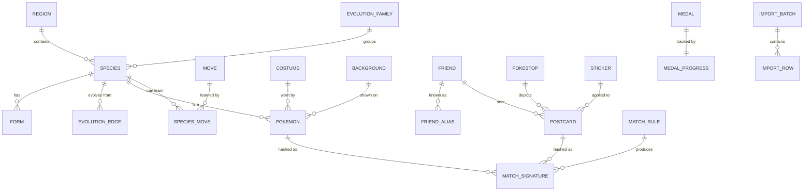

# gokeeper — Architecture (v1)

**Stack:** Python 3.13+ · FastAPI · HTMX · Jinja2 · Pico.css · SQLite (stdlib `sqlite3`) · `platformdirs` · `uv`

Runtime dependencies are FastAPI, Uvicorn, Jinja2, and `platformdirs`. HTMX and Pico.css are vendored under `web/static/` so the app stays offline-first. Everything else is stdlib (`sqlite3`, `tomllib`, `hashlib`, `threading`). `platformdirs` earns its place by resolving the OS-appropriate data directory (§7.1) — the alternative is per-platform path logic that is wrong on at least one OS.

The domain library (`src/gokeeper/`) has no HTTP or HTML imports. The web layer (`web/`) is the only place that renders templates or reads form posts. That seam is intentional: other local tools can share the library (and later the same FastAPI process via additional routers) without sharing UI code.

Reference figures in this document were verified against the 2026-08-18 Game Master and companion sources on 2026-08-23.

---

## 1. Overview and scope

gokeeper is a single-user, locally-run app for taking and maintaining an inventory of a Pokémon GO account: caught Pokémon and their attributes, medal progress, and the postcard book. On top of inventory, it provides a configurable duplicate detector for Pokémon and postcards, and a disposition marker that turns detected duplicates into an actionable queue.

### 1.1 Functional requirements

| # | Requirement |
|---|---|
| F1 | Record Pokémon instances with a rich attribute set (IVs, form, costume, moves, origin, background, …) |
| F2 | Record postcards with sender, PokéStop, location, and open date |
| F3 | Record medal tier and raw progress value, with distance-to-next-tier derived |
| F4 | Data entry primarily by manual form; CSV import is a secondary bulk path |
| F5 | Flag duplicates among Pokémon and among postcards, where "duplicate" is defined by a user-selected set of fields |
| F6 | Support grouping across evolution families, not only exact species |
| F7 | Mark a duplicate's disposition (`KEEP` / `REVIEW` / `RELEASE`) from the duplicate browser |
| F8 | Add custom reference data — medals, costumes, backgrounds, stickers, PokéStops — as a first-class in-app flow |
| F9 | Browse, filter, sort, and export every collection |

### 1.2 Non-functional requirements

- **Single user, single machine.** No auth, no multi-tenancy. The UI is a local HTTP server bound to `127.0.0.1` (not a public service).
- **Scale target:** ~10k Pokémon rows, ~2k postcards, ~1,000 medals. No query needs to beat ~200 ms.
- **Offline-first.** No runtime dependency on any external API. Reference data ships as CSV in the repo.
- **Durable and inspectable.** The database is one file that can be copied, backed up, and opened in any SQLite browser. It lives in the OS application-support directory, overridable by the user (§7.1).
- **Dependency-light.** stdlib `sqlite3` and hand-written SQL. No ORM.

### 1.3 Non-goals

- No IV/CP calculators, PvP rank tables, or power-up recommendations.
- **No living-dex completeness logic.** gokeeper models evolution as data and lets a rule express a grouping; it does not compute "you need two more Charmander." See §6.4.
- No screenshot storage or OCR ingestion.
- No multi-account support. The schema leaves room; the UI does not.
- No sync with Niantic. There is no public API, so manual entry (and optional CSV) are the ceiling. GO has no inventory export; a spreadsheet-first workflow is out of scope.

---

## 2. Architecture

The diagram shows layers. The complete service inventory is in §2.2 and the complete route list in §9.

```
┌────────────────────────────────────────────────────────┐
│  Web  (web/)  FastAPI · Jinja2 · HTMX · Pico.css         │
│  HTML forms · tables · CSV wizard · duplicate browser    │
└────────────────────────┬────────────────────────────────┘
                         │  HTTP handlers call services only
                         │  no SQL, no matching internals
┌────────────────────────▼────────────────────────────────┐
│  Services  (src/gokeeper/services/)                      │
│  one module per aggregate; owns transactions             │
└──────┬──────────────────────────────┬────────────────────┘
       │                              │
┌──────▼────────────────┐  ┌──────────▼─────────────────────┐
│  Matching engine      │  │  Repositories (db/)             │
│  PURE functions —     │  │  SQL only, no business logic,   │
│  no DB, no I/O        │  │  returns dicts                  │
└───────────────────────┘  └──────────┬──────────────────────┘
       ▲                              │
       │ reads                        │
┌──────┴────────────────┐  ┌──────────▼──────────────────────┐
│  Field registry       │  │  SQLite file (WAL mode)         │
│  (declarative specs)  │  └─────────────────────────────────┘
└───────────────────────┘
```

**Core principle: the matching engine is pure.** It takes a mapping of field values plus a rule and returns a signature string. No database handle ever enters it. This makes the most intricate part of the app trivially unit-testable, and it means a rule change is a recompute rather than a migration.

Services own transaction boundaries. Repositories never open or commit transactions; they take a cursor.

### 2.1 The field registry

One `FieldSpec` per attribute is the single source of truth for four things that would otherwise drift apart.

```python
@dataclass(frozen=True)
class FieldSpec:
    key: str                       # "atk_iv"
    label: str                     # "Attack IV"
    kind: FieldKind                # INT | TEXT | BOOL | ENUM | DATE | REAL | FK
    column: str | None = None      # DB column; None for virtual fields
    compute: Callable[[Mapping], Any] | None = None   # virtual fields only
    fk_table: str | None = None    # for FK kind: "costume", "background", ...
    choices: tuple[str, ...] | None = None
    normalizer: Callable[[Any], str] = default_norm
    matchable: bool = True         # eligible for duplicate rules
    csv_aliases: tuple[str, ...] = ()
```

Derived from that declaration:

1. **Manual entry widgets** — `kind` selects the HTML control (Jinja macro in `web/`; the library does not import templates).
2. **CSV header mapping** — `csv_aliases` drives auto-detection; `kind` drives coercion and validation.
3. **Duplicate rule options** — the rule editor lists every `matchable=True` field.
4. **Table column config** — labels, types, sort behavior.

Fields with `matchable=False` (`id`, `notes`, `created_at`, `updated_at`) never appear in the rule editor. Adding a tracked attribute is a migration plus one `FieldSpec`.

### 2.2 Service inventory

| Module | Operations |
|---|---|
| `services/pokemon.py` | `add`, `update`, `release`, `unrelease`, `set_disposition`, `get`, `list_filtered` |
| `services/postcards.py` | `add`, `update`, `delete`, `set_disposition`, `get`, `list_filtered` |
| `services/medals.py` | `upsert_progress`, `list_with_next_tier`, `add_custom_medal` |
| `services/friends.py` | `add`, `update`, `record_alias`, `merge`, `list_filtered` |
| `services/reference.py` | `list_entries`, `add_custom_entry`, `rename_entry`, `merge_entries`, `deactivate_entry` — generic over all lookup tables (§5) |
| `services/matching.py` | `create_rule`, `update_rule`, `delete_rule`, `set_active`, `rebuild_signatures`, `list_duplicate_groups`, `get_group_members`, `summarize_group` |
| `services/importer.py` | `create_batch`, `parse_file`, `propose_mapping`, `validate_batch`, `preview_batch`, `commit_batch`, `discard_batch` |
| `services/export.py` | `export_filtered_csv` |
| `services/admin.py` | `run_migrations`, `check_seed_version`, `apply_seed`, `backup_db` |

### 2.3 Web layer

FastAPI routes are adapters: parse the request, call a service, return HTML (full page or an HTMX fragment). They do not open transactions, run SQL, or import `matching/` except through `services/matching.py`.

- **Full pages** — `GET` returns a Jinja document with nav, Pico.css, and vendored `htmx.js`.
- **Fragments** — `POST`/`PATCH` with `HX-Request` return a partial (one row, one group, flash message). Disposition radios on the duplicates home page are the main example: each change is one service call and a swapped fragment, not a full reload.
- **Session** — Starlette `SessionMiddleware` (signed cookie) holds sticky form defaults (§9.1) only. Inventory lives in SQLite.
- **Bind** — Uvicorn listens on `127.0.0.1`. Startup `lifespan` opens SQLite, applies migrations, and checks seed version.

A later sibling tool is another FastAPI `APIRouter` mounted on the same app, calling its own services (or this library). It does not share templates.

---

## 3. Data model — reference entities



### 3.1 `region` and `species`

**`region`** — `id`, `name` (`Kanto`, `Johto`, …), `generation_no`, `sort_order`

Region and generation number map one-to-one, so storing both on `species` would be redundant with a guaranteed drift risk. A nine-row table gives the canonical display name and a sort order, and keeps `generation_no` available for numeric filtering.

**`species`** — `id`, `dex_no`, `name`, `region_id`, `family_id`, `evolution_stage`, `type_1`, `type_2`, `is_legendary`, `is_mythical`, `is_ultra_beast`, `is_baby`, `is_regional`, `is_released_in_go`

`is_baby` and `is_regional` support "what am I missing" views. `is_released_in_go` distinguishes species that exist in the National Dex but have never appeared in GO, which keeps the species dropdown honest.

**`form`** — `id`, `species_id`, `name`, `is_active`

### 3.2 `evolution_family`, `evolution_edge`, `evolution_override`

**`evolution_family`** — `id`, `family_key` (`FAMILY_CHARMANDER`), `base_species_id`, `display_name`

**`evolution_edge`** — `id`, `from_species_id`, `from_form_id` (nullable), `to_species_id`, `to_form_id` (nullable), `candy_cost`, `candy_cost_purified`, `requirement` (JSON), `priority`

Edges are form-qualified on both ends, because evolution in GO is form-preserving in a way a species-only edge cannot express: Alolan Vulpix evolves to Alolan Ninetales, Kantonian to Kantonian. The Game Master models it identically, so the seeder is close to a direct transcription.

`requirement` is JSON rather than columns because the shape varies widely — buddy distance, time of day, item, lure, gender, trade — and none of it is ever matched on. It exists so the UI can render "needs 10 km as buddy, daytime" beside a family group.

**Mega Evolution is excluded from edges.** It is temporary and reversible, lives in a separate Game Master section, and is a state rather than a transition. Modelling it as an edge would corrupt `evolution_stage`.

**`evolution_override`** — `from_species_id`, `to_species_id`, `note`; hand-maintained, five rows

Five families contain a member with no inbound edge in the source data (§8.3), so a naive depth computation would seed them as separate stage-1 roots. Each row is a judgement call rather than a mechanical fix — Shedinja is arguably correct as a root, being a by-product of evolving Nincada rather than an evolution of it — which is why the table carries a `note`.

**`species.evolution_stage`** is computed at seed time as depth in the family graph, 1-indexed, and stored. Matching and sorting both want a plain integer column rather than a recursive CTE. The graph is a DAG rather than a chain, and stage is depth rather than sequence, so all eight Eeveelutions sit at stage 2.

### 3.3 `move` and `species_move`

**`move`** — `id`, `move_key`, `name`, `kind` (`FAST` / `CHARGED`), `type`, `is_active`

**`species_move`** — `species_id`, `form_id` (nullable), `move_id`, `availability` (`CURRENT` / `LEGACY` / `ELITE_TM_ONLY` / `EVENT_EXCLUSIVE`), `first_seen`, `notes`

Legacy status is a property of a *(species, move)* pair, not of a move: Body Slam is legacy on Snorlax and ordinary elsewhere. A flag on `move` could not express this.

`ELITE_TM_ONLY` applies to both `kind` values — Elite Fast TMs and Elite Charged TMs both exist, and the Game Master carries `eliteQuickMove` on 182 species entries alongside `eliteCinematicMove` on 428. No asymmetry validation rule.

This table is reference and validation data only. Duplicate matching uses `move_id` directly, so availability never enters a signature. It is also the largest single seeding job in the project; `pokemon.fast_move_id` and friends are plain FKs to `move` and function correctly against an empty `species_move`, at the cost of moveset legality validation and a legacy indicator in the UI.

### 3.4 `costume`, `background`, `sticker`

All three follow the `ReferenceTableSpec` pattern in §5: `id`, `key`, `name`, `source` (`SEED`/`USER`), `is_active`, plus type-specific columns.

**`costume`** — `+ costume_id` (protocol enum ID), `+ proto_key`, `+ no_evolve`, `+ gm_form_key` (nullable)
**`background`** — `+ location_card_id`, `+ proto_key`, `+ image_key`, `+ event_name`
**`sticker`** — `+ pokemon_id` (species depicted), `+ category`, `+ max_count`, `+ release_date`

**`costume.no_evolve`** is a seeded boolean. Costume evolvability is per-costume rather than per-species — costumed Kanto starters evolve, costumed Kirlia does not — and the protocol encodes this directly: 43 of the 87 `Costume` enum values carry a literal `_NOEVOLVE` suffix (§8.2). No user judgement is required.

`costume_id` is the protocol enum ID (0–87), a stable natural key that survives renames.

**Costume is a different axis from form.** GO has costumes-as-forms — 93 entries flagged `isCostume` in the Game Master's `formSettings`, which carry their own stats and can define costume-preserving evolutions — *and* a costume attribute layered on a normal form, which is the 87-value enum. `gm_form_key` links the two where a costume exists in both and is null otherwise.

`postcard.sticker_id` is a single nullable FK; a postcard holds at most one sticker.

### 3.5 `medal` and `medal_progress`

**`medal`** — `id`, `badge_key`, `name`, `category`, `rank_count`, `target_1` … `target_4`, `is_event_badge`, `source`, `is_active`

Tier thresholds are a `rank_count` plus an ordered target list rather than fixed bronze/silver/gold/platinum columns, because rank counts vary: `BADGE_7_DAY_STREAKS` has five ranks with four targets, while event badges commonly have two ranks with one. Distance-to-next-tier reads `target_[tier_achieved + 1]`.

**`medal_progress`** — `medal_id` (PK, FK), `current_value`, `tier_achieved`, `updated_at`

Tier is stored rather than derived, because some medals are untiered or event-only and do not fit the threshold shape. A validation warning fires when the stored tier disagrees with the thresholds — flagging a typo without blocking the save.

Medals are single-instance per account and sit outside the duplicate system entirely.

---

## 4. Data model — instance entities

### 4.1 `pokemon`

| Group | Columns |
|---|---|
| Identity | `id`, `species_id`, `form_id`, `costume_id`, `gender`, `nickname` |
| Rarity flags | `is_shiny`, `is_lucky`, `shadow_state` (`NORMAL`/`SHADOW`/`PURIFIED`), `is_traded`, `is_favorite` |
| Stats | `atk_iv`, `def_iv`, `hp_iv`, `cp`, `hp`, `level`, `weight_kg`, `height_m`, `size_class` |
| Moves | `fast_move_id`, `charged_move_1_id`, `charged_move_2_id` |
| Buddy / Max | `buddy_level`, `dynamax_level`, `is_gigantamax` |
| Provenance | `origin`, `caught_at`, `caught_location`, `background_id`, `original_trainer` |
| Workflow | `disposition` (`KEEP`/`REVIEW`/`RELEASE`, nullable) |
| Housekeeping | `tags` (JSON array), `notes`, `is_released`, `released_at`, `created_at`, `updated_at` |

IVs are Attack / Defense / HP, matching what GO surfaces.

```sql
level REAL NOT NULL CHECK (
  level >= 1 AND level <= 51 AND level * 2 = CAST(level * 2 AS INTEGER)
)
```

Levels advance in half-steps, and every half-step is exactly representable in IEEE 754 (0.5 is 2⁻¹), so `REAL` equality is safe. The CHECK enforces the domain. The residual risk is formatting on CSV import — `"40.50"`, `"40,5"` — which is the normalizer's job (§6.3).

`origin` enum: `WILD`, `RAID`, `EGG`, `RESEARCH`, `TRADE`, `BATTLE_LEAGUE`, `INCENSE`, `PURIFY`, `EVOLVE`, `MAX_BATTLE`, `OTHER`.

**Soft delete.** Transferring a Pokémon in-game sets `is_released = 1` rather than deleting the row. Inventory history survives, and duplicate views filter on `is_released = 0` by default.

### 4.2 `friend` and `friend_alias`

**`friend`** — `id`, `nickname`, `trainer_code`, `friendship_level`, `country`, `notes`, `is_active`
**`friend_alias`** — `id`, `friend_id`, `nickname`, `first_seen`, `last_seen`

Postcards reference `friend_id` and render whatever `friend.nickname` currently holds, so the postcard list stays correct regardless of how GO handles renames internally.

The failure mode is creating a second `friend` row after a trainer renames. `friend_alias` prevents it: every nickname a friend has held is retained, and entry autocomplete searches aliases alongside current names, so typing an old name finds the existing friend. `friend` also participates in the §5 merge machinery, which repairs the problem once noticed — but the alias table is the half that prevents it. `trainer_code` is the only fully stable identity, worth recording for frequent senders.

### 4.3 `pokestop` and `postcard`

**`pokestop`** — `id`, `name`, `city`, `region_name`, `country`, `is_custom`, `created_at`. Unique on `(name, city, region_name, country)`.

GO exposes stop name plus city, region, and country and nothing more, so that composite is the natural identity. Promoting it to its own table makes postcard duplicate matching a single FK comparison instead of four normalized string comparisons, gives autocomplete on re-entry, and prevents a typo in one postcard's city from silently splitting a duplicate group.

**`postcard`** — `id`, `friend_id`, `pokestop_id`, `opened_at`, `sticker_id` (nullable), `is_favorite`, `in_scrapbook`, `disposition`, `notes`, `created_at`, `updated_at`

---

## 5. Reference data: one pattern, seven tables

`medal`, `costume`, `background`, `sticker`, `pokestop`, `form`, and `friend` all share one spec:

```python
@dataclass(frozen=True)
class ReferenceTableSpec:
    table: str
    label: str
    natural_key: tuple[str, ...]
    editable_columns: tuple[FieldSpec, ...]
    seedable: bool
```

Every reference table carries `source TEXT NOT NULL CHECK (source IN ('SEED','USER'))` and `is_active INTEGER NOT NULL DEFAULT 1`.

- **Seed refresh never touches `source='USER'` rows.** Applying a newer seed is an upsert on natural key restricted to `source='SEED'`.
- **Natural-key collision preserves IDs.** If a later seed introduces an entry already added by hand, the seed row wins on metadata but the ID is kept and the row is relabelled `SEED`. Existing FKs keep pointing at the same ID.
- **Never delete, deactivate.** `is_active = 0` removes an entry from new-entry dropdowns and leaves it intact on rows that already reference it.
- **Merge, don't orphan.** `merge_entries(from_id, to_id)` repoints FKs in one transaction, then deactivates the source. This is what makes free-text-derived tables like `pokestop` tolerable.

One reference-data route (§9) drives all seven tables off this spec. Custom entries cover the lag between an event dropping and the source data being mined.

---

## 6. Duplicate detection

### 6.1 Model

```
MATCH_RULE
  id, entity_type ('pokemon'|'postcard'), name,
  field_keys (JSON array — canonical sorted tuple; see below),
  null_policy ('NULL_MATCHES_NULL' | 'NULL_NEVER_MATCHES'),
  is_active, created_at

MATCH_SIGNATURE
  rule_id, entity_type, entity_id,
  signature      TEXT   -- human-readable canonical string
  signature_hash TEXT   -- blake2b-128 hex of signature
  computed_at
  PRIMARY KEY (rule_id, entity_type, entity_id)
```

Both the readable signature and its hash are stored. The hash is indexed and grouped; the readable string answers "why are these two duplicates?", which is the question that always follows.

**`field_keys` is stored already sorted.** On `create_rule` / `update_rule`, the service sorts the field key list lexicographically and persists that canonical JSON array. UI checkbox order must not produce a distinct rule: two rules with the same fields in different selection order are identical after write, and equality / "is this preset already saved?" compares the stored form. Signature construction iterates `rule.field_keys` in storage order and does not re-sort.

### 6.2 Signature construction

```python
def signature(rule: MatchRule, row: Mapping[str, Any], registry: Registry) -> str:
    parts = []
    for key in rule.field_keys:                    # already canonical-sorted in DB
        spec = registry[key]
        value = spec.compute(row) if spec.compute else row.get(key)
        if value is None:
            if rule.null_policy is NullPolicy.NEVER_MATCHES:
                return f"__unique__:{row['id']}"   # opts this row out entirely
            parts.append(f"{key}=\x00")
        else:
            parts.append(f"{key}={spec.normalizer(value)}")
    return "|".join(parts)
```

The `__unique__` sentinel means that under `NULL_NEVER_MATCHES` a row missing any rule field can never group with anything — the correct default while an inventory is half-entered.

### 6.3 Normalizers and virtual fields

- **Text** — strip, casefold, collapse internal whitespace
- **Booleans** — `"0"` / `"1"`
- **FKs** — the integer ID, never the display name, which is why merge (§5) matters
- **`level`** — `f"{value:.1f}"`
- **Dates** — ISO date only; time-of-day never enters a signature
- **`charged_moveset`** — virtual; sorts the two move IDs before joining, so Move A/Move B matches Move B/Move A. The individual move columns remain separately matchable for strict slot ordering
- **`iv_total`** — virtual; `atk_iv + def_iv + hp_iv`. Exact IV triples collide rarely enough that strict matching produces almost no groups, and for a keep/release decision the total carries the information
- **`family_id`**, **`evolution_stage`** — `species` columns resolved by join, exposed as matchable (§6.4)

Virtual fields live in the registry with a `compute=` callable instead of a `column=`.

### 6.4 Evolution-aware grouping

`family_id` and `evolution_stage` are ordinary matchable fields, so a rule selecting `family_id` groups every member of a line together regardless of stage. Three Charmander and one Charmeleon land in a single group under `family_id + is_shiny`.

**Evolution is data, not logic.** gokeeper has no notion of a living dex, does not compute coverage, and does not know that evolving consumes the pre-evolution. It exposes family and stage as fields; the grouping is a rule the user writes. Two consequences:

- **Family groups are heterogeneous by design.** The group browser sorts members within a group by `dex_no` then `evolution_stage` so the line reads in order, and `species` shows as a differing field. That is the intent, not a defect.
- **Equality-grouping cannot express coverage.** A signature answers "which rows are the same?", never "which stages am I missing?" Family grouping puts the line in front of the user; reading what is absent is still their eyes. A real coverage view would be an aggregate query over `species × family`, not a match rule, and belongs in a later page rather than bent into the matching engine.

**One guardrail.** When a family group contains a member whose costume has `no_evolve = 1`, the browser flags that row. The implicit reading of a family group — "I have four of this line, so I can evolve the spares into the gaps" — is false for a costumed Kirlia, and a row that silently cannot do what the group implies is a trap rather than a preference. It renders as a marker on the row; it does not reorder or filter anything.

**Group composition summary.** `summarize_group(group, by_field)` returns a count breakdown over a chosen field — "3 × Charmander, 1 × Charmeleon" grouped by species, "5 × shiny" grouped by `is_shiny`. Field-agnostic, works on every rule, and it is what makes a family group readable at a glance.

### 6.5 Presets

| Preset | Entity | Fields |
|---|---|---|
| Genetic twin | Pokémon | species, form, gender, shiny, costume, atk/def/hp IV |
| Same IV total | Pokémon | species, form, shiny, `iv_total` |
| Battle-identical | Pokémon | species, form, level, atk/def/hp IV, fast move, `charged_moveset` |
| Collection slot | Pokémon | species, form, shiny, costume, background |
| Family cluster | Pokémon | `family_id`, shiny, costume |
| Family + background | Pokémon | `family_id`, background |
| Whole family | Pokémon | `family_id` only |
| Strict | Pokémon | every matchable field |
| Same stop | Postcard | pokestop |
| Same stop + sender | Postcard | pokestop, friend |
| Same city | Postcard | city, country (via pokestop) |

**UI guardrails.** Selecting `caught_at`, `opened_at`, `nickname`, or `notes` warns that near-unique fields collapse every group to size 1. "Whole family" warns in the other direction — the Eevee family alone spans nine species. Both warn; neither blocks.

### 6.6 Recomputation and freshness

No `is_duplicate` boolean is stored on any entity. Duplication is a property of a rule, not of a row, and caching it on the row guarantees stale flags.

- Signatures recompute per row on insert or update.
- Signatures recompute per entity type when a rule's `field_keys` or `null_policy` change, or when a rule is created.
- `app_meta.registry_version` bumps when a normalizer changes; startup compares it against `match_signature.computed_at` cohorts and rebuilds stale ones.
- **A seed refresh that changes `species.family_id` or `evolution_stage` triggers a rebuild.** A new evolution added to a family silently invalidates every family-based signature otherwise; `apply_seed` sets a dirty flag for this case.
- A full rebuild at ~10k rows is a single sub-second pass.

```sql
CREATE VIEW v_duplicate_groups AS
SELECT rule_id, entity_type, signature_hash,
       COUNT(*) AS member_count,
       MIN(signature) AS signature
FROM match_signature
GROUP BY rule_id, entity_type, signature_hash
HAVING COUNT(*) > 1;
```

### 6.7 Disposition

A nullable column on `pokemon` and `postcard`, set from the duplicate browser.

**Rule-independent by design.** It records the user's decision about a row, not a rule's verdict. Scoping it per-rule would mean switching from "Genetic twin" to "Family cluster" silently discards review work.

`RELEASE` does not set `is_released`. It marks intent; `is_released` records that the Pokémon was actually transferred in-game. The gap between them is the queue.

---

## 7. Persistence

### 7.1 Database location

The database lives in the OS-appropriate application-support directory, resolved by `platformdirs` rather than hardcoded or placed alongside the source.

```python
from pathlib import Path
import os, tomllib
from platformdirs import user_data_dir, user_config_dir

APP_NAME = "gokeeper"

def data_dir() -> Path:
    # 1. environment override
    if env := os.environ.get("GOKEEPER_DATA_DIR"):
        return Path(env).expanduser()
    # 2. config file override
    cfg = Path(user_config_dir(APP_NAME, appauthor=False)) / "config.toml"
    if cfg.is_file():
        with cfg.open("rb") as fh:
            if custom := tomllib.load(fh).get("data_dir"):
                return Path(custom).expanduser()
    # 3. platform default
    return Path(user_data_dir(APP_NAME, appauthor=False))

def db_path() -> Path:
    d = data_dir()
    d.mkdir(parents=True, exist_ok=True)
    (d / "backups").mkdir(exist_ok=True)
    return d / "gokeeper.sqlite"
```

Defaults produced by `user_data_dir("gokeeper", appauthor=False)`:

| OS | Path |
|---|---|
| macOS | `~/Library/Application Support/gokeeper/` |
| Linux | `~/.local/share/gokeeper/` (respects `XDG_DATA_HOME`) |
| Windows | `C:\Users\<user>\AppData\Local\gokeeper\` |

**`appauthor=False` is load-bearing.** On Windows, `platformdirs` otherwise inserts an author directory into the path, producing `AppData\Local\<author>\gokeeper`. Passing `False` suppresses it. The argument is ignored on macOS and Linux, so it is safe to pass unconditionally.

**Two override mechanisms, deliberately.** `GOKEEPER_DATA_DIR` is the quick one — useful for tests, for pointing at a synced folder, or for running a throwaway copy. A desktop shortcut or launcher-started Uvicorn process does not inherit a shell's environment, so an env var alone would silently fail for anyone who does not launch from a terminal. The config file, whose own location is fixed by `platformdirs` and therefore always discoverable, is the override that survives that. Environment wins over config file when both are set.

The resolved path is displayed on Settings. "Where is my database?" is otherwise a surprisingly hard question to answer once the file is somewhere the user never navigates to.

**Everything runtime-generated lives under the data directory** — the database, its `-wal` and `-shm` siblings, and `backups/`. The repository holds only code and the versioned seed CSVs. Keeping the database out of the working tree avoids committing it by accident and avoids losing it on a fresh clone or reinstall.

### 7.2 Connection handling

The FastAPI `lifespan` opens one connection, applies PRAGMAs and migrations, and stores the connection and a write lock on `app.state`. Sync route handlers may run on Uvicorn's thread pool, so the connection is shared across threads.

```python
def connect(path: Path) -> sqlite3.Connection:
    conn = sqlite3.connect(path, check_same_thread=False)
    conn.row_factory = sqlite3.Row
    conn.execute("PRAGMA journal_mode=WAL")
    conn.execute("PRAGMA foreign_keys=ON")
    conn.execute("PRAGMA synchronous=NORMAL")
    return conn
```

A `PRAGMA` is SQLite's configuration statement — it changes engine behavior rather than querying data.

**`check_same_thread=False`** is Python's flag, not SQLite's. Python's `sqlite3` normally refuses to use a connection from any thread other than the one that created it. Uvicorn will call sync endpoints from worker threads that did not open the connection. Disabling the check moves thread-safety onto the application, which is what the write lock below is for.

**`row_factory = sqlite3.Row`** makes results behave like dicts (`row["cp"]`) instead of positional tuples. Ergonomic, but positional access to a thirty-column table is how off-by-one bugs get written.

**`PRAGMA journal_mode=WAL`** enables Write-Ahead Logging. By default SQLite writes by copying old pages into a rollback journal, which locks the entire database for the duration and blocks readers. WAL inverts this: changes append to a separate `-wal` file while readers continue against the last committed state, so readers never block writers and writers never block readers. The setting is persisted in the database file, so it only needs setting once; re-issuing is harmless. Side effect: the database becomes three files on disk (`.sqlite`, `-wal`, `-shm`) — copy all three, or use the `VACUUM INTO` backup in §7.5.

**`PRAGMA foreign_keys=ON`** matters because SQLite ships with foreign key enforcement off by default, for backwards compatibility with pre-2009 databases. Without it, every `REFERENCES` clause is documentation rather than a constraint: a `pokemon` row can point at a nonexistent `species_id` and SQLite accepts it silently. This is a per-connection setting, not stored in the file, so it must be set on every connection, every time.

**`PRAGMA synchronous=NORMAL`** controls how insistently SQLite forces data to physical disk. `FULL` (the default) issues an `fsync` on every commit — safest, and noticeably slow on bulk inserts. `OFF` risks a corrupt database on power loss. `NORMAL` paired with WAL is the officially recommended combination: a crash can lose the most recent transaction or two, but the database itself cannot be corrupted.

**Write serialization.** SQLite allows exactly one writer at a time, database-wide. Every write goes through a module-level `threading.Lock` held around the transaction — four lines that eliminate the entire "database is locked" failure class when two HTMX requests overlap.

### 7.3 Read caching

None at the application layer. Each HTTP request queries SQLite; at the scale in §1.2 that is cheaper than invalidating a cache. HTMX fragments re-query the rows they display. Do not cache repository results in `app.state`.

### 7.4 Migrations

`PRAGMA user_version` — an integer slot in the database file header that SQLite ignores and leaves to the application — plus numbered files in `migrations/` (`001_init.sql`, `002_….sql`), applied in order at startup inside a transaction. No Alembic; the schema history is linear and single-branch.

### 7.5 Backup

A Settings action running `VACUUM INTO` against `data_dir() / "backups" / f"gokeeper-{timestamp}.sqlite"`. Consistent single-file snapshot, correct under WAL, works while the app is open, and lands beside the database rather than in the working directory. Settings lists existing backups with their sizes and timestamps.

---

## 8. Seed data

The pipeline is **Masterfile-primary**, with the Game Master supplying what the Masterfile lacks and `holoholo-text` supplying medal titles.

### 8.1 Sources

| Source | Location | Supplies |
|---|---|---|
| WatWowMap Masterfile | `WatWowMap/Masterfile-Generator` → `master-latest-everything.json` (~3.3 MB) | species, forms, costumes, moves, location cards, family and evolution data, species flags |
| Game Master | `alexelgt/game_masters` → `GAME_MASTER.json` (~19 MB) | medals, stickers, elite move annotations, candy costs, evolution requirements |
| Translations | `sora10pls/holoholo-text` → `Release/English/en-us_raw.json` | medal titles |
| Protocol enums | `@na-ji/pogo-protos` (npm) | `Costume`, `Form`, `LocationCard` enums; upstream of the Masterfile |
| Hand-maintained | `data/seed/evolution_overrides.csv`, `data/seed/regions.csv` | 5 rows, 9 rows |

**Use `alexelgt/game_masters`, not PokeMiners.** As of 2026-08-23 the PokeMiners `latest/` batch timestamp resolved to 2026-04-17 while alexelgt's resolved to 2026-08-18 — the data is four months stale, not merely the repository. `alexelgt` publishes a `timestamp.json` carrying `batchId` and `uploadTime`, which is the freshness check `admin.check_seed_version` uses. It is a single-maintainer repository, so treat it as swappable (§13).

**Use the `@na-ji` scoped protos package.** The unscoped `pogo-protos` ships only a legacy 9-value `POGOProtos.Enums.Costume`. The full 87-value enum is in the `@na-ji` fork.

### 8.2 Coverage

**From the Masterfile:**

| Key | Count | Notable fields |
|---|---|---|
| `pokemon` | 1,025 | `family`, `evolutions`, `generation`, `legendary` (77), `mythic` (23), `ultraBeast` (11), `little`, `stats`, `types`, moves |
| `forms` | 1,498 | `formName`, `proto`, `formId` |
| `costumes` | 87 | `id`, `name`, `proto`, `noEvolve` (43 true) |
| `locationCards` | 246 | `id`, `proto`, `formatted`, `imageUrl` |
| `moves` | 533 | `moveName`, `proto`, `type`, `power` |

`ultraBeast` resolves to exactly the eleven Ultra Beasts, so `species.is_ultra_beast` needs no hand-filling.

**From the Game Master** (18,705 templates in the 2026-08-18 file):

| gokeeper table | Game Master key | Count | Notes |
|---|---|---|---|
| `medal` | `badgeSettings` | 1,004 (75 non-event, 929 event) | `targets` = thresholds, `badgeRank` = tier count, `eventBadge` flag |
| `sticker` | `stickerMetadata` | 623 | `pokemonId`, `category`, `maxCount`, `releaseDate` |
| `species_move` | `quickMoves` / `cinematicMoves` → `CURRENT`; `eliteQuickMove` / `eliteCinematicMove` → `ELITE_TM_ONLY` | 182 / 428 species with elite moves | Not cleanly available elsewhere |
| `evolution_edge` | `pokemonSettings.evolutionBranch` | — | `evolution`, `candyCost`, `candyCostPurified`, target `form`, conditions |
| `costume` (`gm_form_key`) | `formSettings` where `isCostume: true` | 93 across 28 species | Links costumes-as-forms to the enum |

The Masterfile carries no badge or sticker data at all, which is why the Game Master remains in the pipeline.

**Two structural quirks the seeder must handle:**

- **Duplicate species entries.** Vulpix appears three times in `pokemonSettings`: `V0037_POKEMON_VULPIX` (no `form`), `..._VULPIX_NORMAL`, and `..._VULPIX_ALOLA`. Prefer form-qualified entries and treat the bare one as legacy, or phantom rows result.
- **Variable `rank_count`.** `BADGE_7_DAY_STREAKS` has `badgeRank: 5` with four targets; event badges commonly have `badgeRank: 2` with one. This is why §3.5 avoids fixed tier columns.

### 8.3 Evolution-stage anomalies

Across all 541 families, five contain a member with no inbound edge, so a naive depth calculation makes them separate stage-1 roots:

| Family | Extra root |
|---|---|
| `FAMILY_SCYTHER` | `KLEAVOR` |
| `FAMILY_STANTLER` | `WYRDEER` |
| `FAMILY_GIRAFARIG` | `FARIGIRAF` |
| `FAMILY_DURALUDON` | `ARCHALUDON` |
| `FAMILY_NINCADA` | `SHEDINJA` |

None has a matching `evolutionQuestTemplate` either; the 37 quest-gated evolutions in the file cover Annihilape, Kingambit, Armarouge, Ceruledge, Chansey and similar, but not these. The `evolution_override` table (§3.2) is merged before stage computation.

Everything else resolves cleanly. Resulting distribution: 546 species at stage 1, 357 at stage 2, 121 at stage 3, with zero failures to resolve.

### 8.4 Display names

| Table | Source | Coverage |
|---|---|---|
| `medal` | `holoholo-text`, key `badgeType.lower() + "_title"` | 841 / 1,003 (83%) — `BADGE_7_DAY_STREAKS` → "Triathlete" |
| `costume` | Masterfile `name` | 87 / 87 |
| `background` | Masterfile `formatted` | 246 / 246 |
| `sticker` | Synthesized from `pokemonId` + `category` + `releaseDate` | — |

The 17% of badges without a title are numbered event and partner badges (`BADGE_EVENT_0009`, `BADGE_APAC_PARTNER_JULY_2018_6`) which appear to have no player-facing name; fall back to the key.

Stickers have no player-facing names in GO, which is why no source carries them — a synthesized label ("Gimmighoul, 10th Anniversary, 2026") is both automatic and better for search.

Background labels are mechanical humanizations of the proto key ("2023 Lasvegas Gotour 001") rather than marketing names. Paired with `imageUrl` they are enough to identify a background in a dropdown; renaming through the §5 reference editor is optional polish.

`WatWowMap/pogo-translations` syncs hourly and ships per-category English files (`costumes_en.json`, `forms_en.json`, `moves_en.json`, `items_en.json`). It is the friendliest format of the three and a reasonable substitute if parsing the Masterfile proves awkward.

### 8.5 Build and application

**Committed CSVs under `data/seed/` are the public contract** of reference data. Runtime (`admin.apply_seed`) and tests read only those files. Upstream JSON (Masterfile, Game Master, holoholo-text, protos) is an implementation detail of the build script.

**Natural keys only in the seed contract.** Seed CSVs identify rows by stable domain keys (`badge_key`, `costume_id` / `proto_key`, `family_key`, `move_key`, dex number + form proto, and so on). They must not carry runtime surrogate integer `id` values. Surrogates are assigned once in the user database on first apply and preserved on later upserts and USER→SEED collisions (§5). Committed seed ids would disagree with every existing user DB and break the "natural-key collision preserves IDs" rule. Cross-CSV references inside the seed set also use natural keys; `apply_seed` resolves them to integers in dependency order.

`scripts/build_seed.py` reads pinned sources through one adapter per source (parse → normalised records) and emits CSVs. The generated CSVs are committed; the multi-megabyte sources are not. Swapping a mirror means replacing one adapter and re-running the build; `src/gokeeper/` and `web/` must not import source JSON.

`admin.apply_seed` performs an idempotent upsert on natural key, never a wipe-and-reload. `app_meta.seed_version` stores the Game Master `batchId` recorded in the seed metadata CSV (not by fetching GitHub at runtime).

**Cross-source key alignment is the main risk.** The Masterfile keys species by Pokédex ID and costumes by enum ID; the Game Master keys everything by `templateId` string. Join on proto keys (`pokemon.proto`, `costumes[].proto`) rather than on names, and fail loudly on an unmatched join rather than dropping a row — a species seeded without its elite moves is worse than a build error.

Medal `category` for the medals page is derived in the seeder (key-prefix rules plus a small override CSV for the 75 non-event badges), then stored on `medal`. The UI does not infer prefixes at render time.

---

## 9. UI

Manual HTML forms are the primary write path. Pokémon GO has no inventory export; CSV is a secondary bulk path, not a substitute for the entry form.

**Home.** `GET /` is the duplicates queue when any Pokémon or postcard rows exist: active rule, groups sorted by member count, composition summary (§6.4), members side by side with differing fields highlighted, disposition radios per row (`hx-post` → fragment swap). Members sort by `dex_no` then `evolution_stage` so family groups read in line order. An empty database shows an empty state and a prominent add-Pokémon action.

```
web/app.py                 # FastAPI app, lifespan, routers, static
web/routers/
  home.py                  # GET /  duplicates queue (or empty state)
  pokemon.py               # list, add, edit
  postcards.py
  medals.py
  import_csv.py            # secondary wizard
  reference.py             # generic editor over lookup tables (§5)
  settings.py              # rules, backup, seed refresh, export, DB path
web/templates/             # Jinja2; macros for FieldSpec → input
web/static/                # vendored htmx.min.js, pico.min.css
```

**Collection pages** — filterable HTML tables driven by the field registry (species, region, family, shiny, form, origin, disposition, date range, `is_released`). CSV export of the current filtered view is a `GET` that calls `services/export.py`.

**Medals page** — grouped by seeded `category`, progress bar per medal, sorted by closest-to-next-tier. Event badges collapse behind a toggle by default, since 929 of 1,004 are events.

**Add Pokémon / postcard** is reachable from nav and from the empty home state. After a successful save, redirect back to the form (or return the form fragment) with sticky defaults applied — not to the duplicates page — so rapid entry stays on the keyboard loop. The home queue is for review, not for interrupting a raid-weekend typing session.

### 9.1 Data entry

Registry-generated controls via a Jinja macro: `FieldKind` → `<input type="number">`, `<select>`, checkbox, date, text. Native tab order and Enter-to-submit. Autocomplete on large FK lists (species, moves, costumes) uses a `<datalist>` or a small searchable select pattern; filtering still happens server-side when the list is huge.

**Sticky defaults.** After a save, species (and other identity fields) reset; shiny, lucky, origin, and date persist in the signed session. Entering forty raid catches from one weekend should not mean setting `origin=RAID` forty times.

**Two-pass entry** is supported but not enforced: a first pass capturing species, form, shiny, costume, and origin reveals candidate clusters under a coarse rule; a second pass fills IVs, moves, and stats only within those clusters. Every non-identity column is nullable and `NULL_NEVER_MATCHES` keeps half-filled rows from producing false groups.

### 9.2 CSV import

Secondary to the form. Same service pipeline; the wizard is HTMX steps rather than a client-side SPA.

```
upload → parse to import_row (raw JSON) → map columns → validate → preview → commit
```

- **`import_batch`** — `id`, `filename`, `entity_type`, `row_count`, `status`, `created_at`
- **`import_row`** — `id`, `batch_id`, `line_no`, `raw` (JSON), `status` (`PENDING`/`VALID`/`ERROR`/`COMMITTED`), `error_msg`, `entity_id`

Column mapping is auto-proposed from `csv_aliases` and confirmed in an editable table (HTML form fields). Validation coerces by `FieldKind`, resolves species/move/costume names to IDs, and collects all errors per row rather than failing on the first.

**Unknown reference values are not errors.** The preview offers "create as custom entry" per distinct unknown value, routed through `reference.add_custom_entry` in the commit transaction.

**App-managed columns are rejected.** `is_released`, `released_at`, `disposition`, `id`, and the housekeeping timestamps produce a validation error naming them. Released Pokémon are not importable.

**Idempotency.** A `source_hash` (blake2b over the raw row plus filename) carries a unique index. Re-importing the same file is a no-op reporting a skip count.

**Preview before commit** shows new rows, invalid rows with reasons, unknown reference values awaiting a decision, and rows that would land in an existing duplicate group under the active rule. Commit is one transaction; a failure rolls the batch back and leaves `import_batch.status = 'FAILED'` for inspection.

---

## 10. Project layout

```
gokeeper/
├── web/                     # FastAPI + Jinja + HTMX; no SQL
├── scripts/build_seed.py    # adapters → data/seed/*.csv (the seed contract)
├── src/gokeeper/            # domain library; no HTTP, no Jinja
│   ├── registry/            # FieldSpec definitions — pokemon.py, postcard.py, reference.py
│   ├── matching/            # PURE: signature.py, normalizers.py, presets.py
│   ├── db/                  # connection.py, migrations.py, repo_*.py
│   ├── services/            # see §2.2
│   └── models.py            # frozen dataclasses
├── migrations/
├── data/seed/               # versioned reference CSVs (committed public API)
├── tests/{unit,web}/
└── pyproject.toml
```

Runtime state lives outside the repository, in the directory resolved by §7.1:

```
<user_data_dir>/gokeeper/
├── gokeeper.sqlite
├── gokeeper.sqlite-wal      # transient, WAL mode
├── gokeeper.sqlite-shm      # transient, WAL mode
└── backups/
    └── gokeeper-YYYYMMDD-HHMM.sqlite

<user_config_dir>/gokeeper/
└── config.toml              # optional; data_dir override only
```

---

## 11. Testing

The default `pytest` run enforces 100% line and branch coverage on `src/gokeeper` and `web`; see `CONTRIBUTING.md` and `pyproject.toml`.

### 11.1 Pure core

- **`matching/`** — property tests: signature invariant to field order in the rule; `create_rule` / `update_rule` persist a lexicographically sorted `field_keys` array so two write orders yield identical stored rules; two rows differing only in a non-rule field produce identical signatures; `NULL_NEVER_MATCHES` never groups. Table-driven cases per normalizer, with `level` formatting explicitly covered.
- **Evolution seeding** — every species resolves to exactly one family; `evolution_stage` is consistent across branching families (all eight Eeveelutions at stage 2); form-qualified edges preserve form (Alolan Vulpix → Alolan Ninetales, never Kantonian); no edge references a mega; all five `evolution_override` rows apply before stage computation.
- **`build_seed.py`** — golden test against pinned source fixtures; asserts the duplicate-species dedupe, variable `rank_count` handling, `costume.no_evolve` true for exactly the 43 `_NOEVOLVE` enum values, and a hard failure on any unmatched cross-source join.
- **`services/reference.py`** — seed refresh does not touch `source='USER'`; natural-key collision preserves IDs; `merge_entries` leaves zero dangling FKs.
- **`importer`** — golden CSVs including a malformed file and one carrying `is_released`; assert full error collection and that re-import is a no-op.
- **`migrations`** — apply in sequence against `:memory:`, assert final `user_version` and schema. `:memory:` needs `foreign_keys=ON` set explicitly, or constraint tests pass vacuously.
- **Path resolution** — environment override wins over config file, config file wins over platform default, and `~` expands in both. Assert `appauthor=False` by checking the resolved Windows path contains no author segment. Monkeypatch `platformdirs` rather than asserting against real OS paths, so the suite passes on every platform.

### 11.2 Web

HTTP tests via FastAPI's `TestClient` against a seeded temp DB. Assert status codes, HTML contains expected group counts / form fields, and that a POST lands a row. No browser required for the default suite. Optional Playwright later for true keyboard-tab flows.

```python
from fastapi.testclient import TestClient

def test_family_grouping_shows_whole_line(tmp_db, client: TestClient):
    seed_pokemon(tmp_db, ["CHARMANDER"] * 3 + ["CHARMELEON"])
    response = client.get("/", params={"rule": "family-cluster"})
    assert response.status_code == 200
    assert "4" in response.text  # member count in the group summary
```

Target coverage:

- **Smoke** — every `GET` route returns 200 against a seeded temp DB.
- **Entry round-trip** — `POST` the add form, assert the row lands and a follow-up `GET` list includes it; assert sticky session fields survived.
- **Duplicate browser** — seed known-colliding rows; assert group member count, composition summary, and that a disposition `POST` persists.
- **Family grouping** — the case above, plus asserting members sort in line order.
- **Import wizard** — each HTMX step is a POST; assert session/batch id survives across steps.
- **Guardrails** — `caught_at` in the rule editor surfaces the warning; "Whole family" surfaces the large-group warning.

Fixtures set `GOKEEPER_DATA_DIR` to a `tmp_path` for every test and create a fresh FastAPI app (new `lifespan` connection) per case. Without the env override a test run would read and write the developer's real database.

---

## 12. Design decisions

| Decision | Chosen | Alternative | Rationale |
|---|---|---|---|
| Duplicate flag | Derived from rules | Boolean on entity | A row is not duplicate in itself, only relative to a rule |
| Signature storage | Materialized table | Compute on read | Indexed group-by; auditable; cheap to rebuild at this scale |
| Disposition scope | Per row | Per (row, rule) | Switching rules should not discard review work |
| Evolution | Family and edge tables exposed as fields | A dedicated living-dex feature | Enables the use case without encoding it |
| `evolution_stage` | Stored int, computed at seed | Recursive CTE at query time | Matching wants a plain column |
| Mega evolution | Excluded from edges | Modelled as an edge | Temporary and reversible; would corrupt stage depth |
| Legacy moves | `species_move` junction | Flag on `move` | Legacy is a (species, move) property |
| Elite TM | Symmetric across fast and charged | Charged-only | Elite Fast TMs exist; 182 species carry elite fast moves |
| Lookup values | Reference tables + custom flow | Text columns | Enables merge, deactivation, reliable FK matching |
| Costume evolvability | Seeded `no_evolve` boolean | Per-species inference | `_NOEVOLVE` is in the enum name; 43 of 87 |
| PokéStop identity | Own table on composite key | Denormalized on postcard | One FK comparison instead of four fuzzy string compares |
| Friend identity | `friend_alias` + merge | Merge alone | Prevention beats repair; merge only helps once noticed |
| Delete | Soft (`is_released`) | Hard delete | Transfer history is worth keeping |
| `level` | `REAL` + CHECK | Scaled integer | Half-steps are exact in float; CHECK enforces the domain |
| Primary seed source | WatWowMap Masterfile | Hand-rolled from Game Master | Prebuilt; already merges protos and translations |
| Game Master mirror | `alexelgt/game_masters` | PokeMiners | PokeMiners' data is four months stale, not just its repo |
| Medals / stickers / elite moves | Game Master | Masterfile | Masterfile carries none of the three |
| Sticker labels | Synthesized from metadata | Scraped names | Stickers have no player-facing names |
| DB location | `platformdirs` app-support dir | Alongside source; `~/.gokeeper` | Correct per-OS; survives reinstall; never committed by accident |
| Location override | Env var + config file | Env var only | A launcher-started app inherits no shell environment |
| ORM | None (raw SQL) | SQLAlchemy / SQLModel | Small stable schema; keeps the DB file inspectable |
| Migrations | `user_version` + SQL files | Alembic | Zero extra deps for a linear schema history |
| UI | FastAPI + HTMX + Jinja + Pico | Streamlit; NiceGUI; SPA | Forms and a review queue are HTTP; library stays UI-free |
| Bind | `127.0.0.1` | LAN / public host | Single user; not a network product |
| Front-end assets | Vendored HTMX + Pico | CDN | Offline-first; no runtime third-party JS host |
| Write path | HTML form primary | CSV- or spreadsheet-first | GO has no inventory export; CSV is secondary |
| Home route | Duplicate queue | Collection table | Disposition is the reason the app exists vs a sheet |
| Seed contract | `data/seed/*.csv` | Runtime JSON miners | Swappable sources; app never parses Game Master |
| Seed row identity | Natural keys only | Surrogate ids in CSVs | User DB assigns ids once; collision preserve (§5) stays coherent |
| `match_rule.field_keys` | Canonical sorted JSON array | UI selection order | Same field set ⇒ same stored rule; signature need not re-sort |
| Layers | Services + repos kept | Collapse into `store.py` | Same library may be reused by sibling tools |

---

## 13. Open items

1. **`species_move` join reliability.** Elite-move annotations exist only in the Game Master, so every species must join across two sources. Add a build-time assertion that all ~1,025 species match.
2. **Postcard sender names.** Whether GO snapshots the sender's trainer name onto a postcard or resolves it live from the friend record is unverified. The design in §4.2 is correct either way; the answer only affects how often `friend_alias` earns its keep. Checkable in-game by opening an old postcard from a friend known to have renamed.
3. **Medal categories.** `badgeSettings` has no category field, so 1,004 badges arrive flat. Derive `medal.category` in the seeder (key prefixes plus a hand override for the 75 non-event badges); do not infer prefixes in the medals template.
4. **Source bus factor.** `alexelgt/game_masters`, WatWowMap, and `holoholo-text` are independent hobby projects with small maintainer counts. The reader-per-source interface in §8.5 is the mitigation; document in the README how to verify a replacement mirror.
